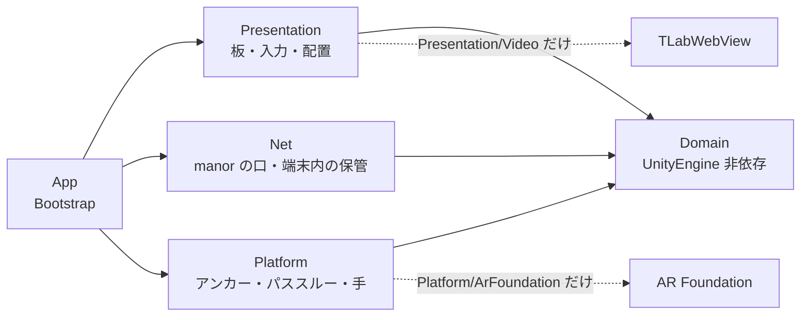

# 構成（層・板・入力・保管）

KitchenXR の中身がどう分かれていて、どこに何が書いてあるかをまとめます。
設計の理由は [`DESIGN.md`](DESIGN.md)、manor との連携は [`MANOR.md`](MANOR.md) に分けてあります。

## 1. 層と依存の向き

| 層 | 置き場 | 持つもの |
|---|---|---|
| Domain | `Assets/KitchenXR/Domain/` | `Recipe`・`Step`・`Phase`・`Ingredient`・`CookSession`（工程の状態機械）・`CookTimer`・`StepText`（説明の `(A)` を材料名に開く）・`RecipeJson`／`RecipeListJson`／`MediaJson`（読み取り） |
| Platform | `Assets/KitchenXR/Platform/` | `IAnchorStore`・`IPassthroughControl`・`IHandInputPolicy` の口と、`ArFoundation/`・`Null/` の実装、`PanelPoseFile` |
| Net | `Assets/KitchenXR/Net/` | `ManorClient`・`ManorDiscovery`・`ManorSettings`・`ManorDeviceFile`・`RecipeStore`・`MediaStore`・`CookEventQueue`・`LastSessionStore` |
| Presentation | `Assets/KitchenXR/Presentation/` | 板（UI Toolkit）・`PokePress`・`PanelPlacement`・`WristMenu`・`FingertipCursor`・`Video/` |
| App | `Assets/KitchenXR/App/` | `Bootstrap`（どのアダプタを挿すか）・`FileLog`・`Editor/`（シーン生成・ビルド） |

守っている規則は3つで、いずれも `Tests/EditMode/PlatformIsolationTests.cs` が検算します。

- **Domain は UnityEngine に依存しない。** `KitchenXR.Domain.asmdef` は
  `noEngineReferences: true`（参照は Newtonsoft.Json だけ）なので、構造として破れません。
- **機種・XR SDK 固有の呼び出しは `Platform/<系>/` の中だけ。**
  `UnityEngine.XR.ARFoundation`・`OVR`・`PXR` への言及がその外に出たら試験が落ちます
  （`Platform/PanelPoseFile.cs` や `Platform/Null/` も「外」です）。
- **WebView に触るのは `Presentation/Video/` の中だけ。** 板は `IVideoPlayer` の口しか見ません
  （WebView は Android にしか無いので、Editor では `NullVideoPlayer` に差し替わります）。

アセンブリは `KitchenXR.Domain`・`KitchenXR.Runtime`・`KitchenXR.App.Editor`・
`KitchenXR.Tests.EditMode`・`KitchenXR.Tests.PlayMode` の5つです。

## 2. 板の一覧

すべてワールド空間の UI Toolkit パネルで、`Presentation/WorldSpacePanelFactory` が一本の経路で
組み立てます（シーン生成と PlayMode 試験が同じ経路を通ります）。`PanelSettings` は World Space・
Pixels Per Unit 100、板の `localScale` は 0.2 なので **1 UI px = 2mm** です。

| 板 | 実装 | 大きさ | 何を持つか |
|---|---|---|---|
| 一覧 | `RecipeListPanel` | レシピの板と同じ | 3列のカード（写真・題名・分／分類／kcal）、設定の区画、ペアリング番号の覆い |
| レシピ | `RecipePanel` | 260×190 px ≒ 52×38cm | 工程の点列と進捗%、左に工程画像（正方形）、右に見出し・説明・グループの添え行・材料の札・「次: …」、下に `[一覧へ][配置] … [戻る][次へ]`。右の列が入り切らなければその列だけ文字を 6px → 5px → 4.5px と落とす |
| 材料 | `IngredientsPanel` | 170×240 px ≒ 34×48cm | チェックの行（縦のみ。16 点までスクロール無し）。今の工程で使う材料を強調 |
| タイマー | `TimerPanel` | 220×220 px ≒ 44×44cm | 1/3/5/10 分と ±30 秒で作り、3つまで同時に動く。終了は合成音と点滅 |
| 動画 | `Presentation/Video/VideoPanel` | 16:9 は 354×224 px、9:16 は 206×264 px | 左に窓（WebView）・右に再生リスト（100 px 幅は向きで変えない）・下に操作部と札3行 |
| 手首メニュー | `WristMenu`・`WristMenuButton`・`PlacementMenuPanel` | 釦 22×22 px ≒ 4.4cm 角／メニュー 130×92 px | 調理中は「配置」1つ、配置モード中は「保存」「元に戻す」「板を手元に」「やめる」 |

一覧とレシピは**同じ場所に置かれる2枚**で、アンカーの鍵も共有します（`panel.recipe`）。

## 3. 入力

- **ポークは押し下げで発火。** `Presentation/PokePress` が `PointerDown` に反応し、押し上げは
  見ません（手応えの無いホログラムは深く突き抜けるので、押し上げが板の中で起きません）。
  二重発火は `ClickDebounce`（600ms）と「その指が板から離れるまで次を受けない」で止めます。
  板の当たり判定の箱は**裏側にだけ** 24cm 伸ばしてあり、深く突き抜けても指が抜けません。
- **レイは層で絞る**（`Presentation/CookingModeInputGate`）。Near-Far Interactor は
  どちらのモードでも生かしたまま、届く先を2つの層で決めます。
  - Interaction Layer（XRI の 1 番 = `Video`）: 調理モードの Ray は `Video` だけ、配置モードは全部。
  - 物理層（8 番 `Kitchen Panel Off Ray`）: Interaction Layer は UI Toolkit の当たりには効かない
    ため、調理モードの間は動画以外の板をこの層へ移します。Ray の `raycastMask` からは外れ、
    `Physics.DefaultRaycastLayers` には残るので**指では押せてレイでは押せない**状態になります。
  - `RayLineVisibility` がホバー・選択のある間だけレイの線と `LineRenderer` を出します。
- **配置モード**（`PanelPlacement`）: Ray＋Grab で板を掴んで動かします。同じ鍵に重なった板は
  **見えている側を取っ手役**に選び、残りは引っ込めます。出口は手首メニューにしかないので、
  メニューが挿さっていない／手が1つも追えていないときは配置モードへ入りません。
- **指先カーソル**（`FingertipCursor`）: 板に 5cm 以内へ近づいたときだけ、人差し指の先に直径 8mm の
  球を出します。近いほど大きくして距離計にし、押した瞬間だけ一瞬強く光らせます。左右の手と
  コントローラの Poke Interactor 4つすべてに付きます。
- **効果音**（`PressSound`）: ボタンが発火した瞬間に短い音を1つ鳴らします。

## 4. オフライン優先（端末内の保管）

表示は**常に端末内の写しから**行い、サーバへの報せは待ち行列に積むだけです。すべて
`Application.persistentDataPath` の下に置きます（Quest 3 では
`/sdcard/Android/data/<applicationId>/files/`）。

| 置き場 | 実装 | 役割 |
|---|---|---|
| `recipes/index.json`・`recipes/<id>/recipe.json`・画像 | `Net/RecipeStore` | 一覧とレシピの写し。レシピを選ぶと契約 JSON と画像（hero＋全工程）を**先に全部**落としてから調理を始める |
| `media.json`（控えは `media.bundled.json`） | `Net/MediaStore` | 動画リストの写し。同梱の `StreamingAssets/media.json` は見本 |
| `media-thumbs/<video_id>.jpg` | `Presentation/Video/MediaThumbnailCache` | 再生リストのサムネイル。id ごとに決まるので一度取れば通信しない |
| `cook_events.jsonl` | `Net/CookEventQueue` | 進行（`next`／`prev`／`end`）の待ち行列。積んだ順に送り、送れた分だけ消す |
| `last_session.json` | `Net/LastSessionStore` | 最後に開いていた調理。manor に繋がらないときの復帰に使う |
| `settings.json` | `Presentation/DisplaySettings` | 文字と板の大きさ（小・中・大）。壊れていれば黙って既定に戻す |
| `logs/kitchenxr.log` | `App/FileLog` | 1MB で3世代まで回す |

`Bootstrap` の起動順は「待ち行列を流す → 途中の調理があれば復帰 → 無ければ一覧 →
選んだら手元へ先読み → 調理の板へ」です。**送れないことで調理は止まりません。**

## 5. アンカー（板の置き場所を覚える）

- `Platform/ArFoundation/ArAnchorStore` が AR Foundation の永続アンカーを使います
  （`TryAddAnchorAsync` → `TrySaveAnchorAsync` の `SerializableGuid` を `anchors.json` へ。
  復元は `TryLoadAnchorAsync`）。Saved Anchor Ids の列挙は非対応なので、GUID は自分で持ちます。
- **鍵は板1枚＝1つ**（`panel.recipe`・`panel.ingredients`・`panel.timer`・`panel.video`）。
  台所全体の座標系は作りません（アンカーは近いほど精度が高い）。
- **控え `panels.json`**（`Platform/PanelPoseFile`）に XR Origin 基準の相対 Pose を**必ず一緒に**
  書きます。部屋が変わればアンカーの復元は普通に失敗するので、受け皿が要ります。
- 復元の順は アンカー → 控え → 既定（頭の前 0.8m）。戻した板は 0.6 秒かけて薄く出します。
- アンカーも控えも位置と向きしか持たないので、**縮尺は起動のたびに `settings.json` から当て直します**。
- Editor の XR Simulation は Save／Load／Erase のどれも非対応なので、必ず控えの側を通ります。

> **板を置き直す手順**: ①手首の釦を反対の手で押してメニューを出し「配置」を押す
> （レシピ／一覧の板の頭の「配置」2度押しでも入れます）。②全部の板に琥珀の枠と取っ手が出るので、
> レイで指して掴んで置き直す（遠くからでも引き寄せられます）。奥へ行ってしまったら
> 「板を手元に」で初期配置へ戻します。③「保存」で覚えて調理モードへ戻る（「元に戻す」は
> 入る前の位置へ、「やめる」は戻して抜ける）。配置モードの間、調理の板のボタンは効きません。

## 6. 動画の板（WebView を包む）

- `Assets/TLab/Youtube/Prefab/YoutubePlayer.prefab` を**書き換えずに包みます**。絵は
  プレハブのワールド空間 Canvas ＋ RawImage をそのまま「窓」の手前に重ねます——UI Toolkit の
  `backgroundImage` に貼り替えると、動的アトラスに焼かれて外部テクスチャの更新が届かず
  最初の1枚で固まります（実機でしか出ない止まり方）。当たり判定は UI 側の板だけが持ちます。
- `YoutubePlayer.cs` は asmdef の無いフォルダにあり `Assembly-CSharp` に入るため、
  `YoutubePlayerBridge` が**型の名前で引き当てて**呼びます（`TLabWebView` は asmdef を持つので
  型でそのまま呼べます）。
- **窓そのものに触れます。** `VideoPanel` が絵の中の比（u, v）に写して
  `IVideoPlayer.Touch(phase, u, v)` へ流し、`YoutubePlayerBridge` が解像度を掛けて
  `TLabWebView.TouchEvent` を送ります。窓は釦ではないので `PokePress` は通しません。
  - タップとドラッグは**板の側で見分ける**。動きが絵の幅の 3% を越えるまで DOWN を送らず、
    越えないまま 1.2 秒以内に離れたらタップ（DOWN → 80ms → UP を同じ座標で）。
    これをしないと手の震えが DRAG になり、WebView はスクロールと解釈してクリックを出しません。
  - 関連動画が `youtube.com/watch` へ遷移したら（0.5 秒ごとに URL を見ている）、
    URL から video_id を抜いて html を読み直し、埋め込みプレイヤーへ連れ戻します。
  - 読み込み後と向きの切り替えごとに、`html`・`body` の上でだけ `touchmove` を止める JS を送ります
    （iframe の中は素通し。html そのものは書き換えません）。
- 板の札は3行——中の様子と絵の実寸／板が最後にしたこと／最後の失敗（赤）。
  実機で切り分けるための唯一の窓口です。

## 7. 表示の設定

一覧の板の「設定」で、一覧と**入れ替わりに**設定の区画が出ます（板は増やしません）。
「文字の大きさ [小][中][大]」「板の大きさ [小][中][大]」「閉じる」の3行だけで、押した瞬間に
反映して保存します（「決定」は置きません）。

- **文字**: `DisplaySettingsApplier` が板の `.root-panel` に `font-scale--small` /
  `font-scale--large` を付け外しし、`theme.uss` がその配下で `--font-size-*` を上書きします
  （小 ×0.85・大 ×1.25）。カスタムプロパティは継承するので中の要素も一緒に動きます。
- **板**: `localScale` を `WorldSpacePanelFactory.PanelLocalScale` × 係数（0.85／1.0／1.2）に
  します。コライダーはローカル単位なので一緒に拡縮され、押せる場所もずれません。
- 当てる先は一覧・レシピ・材料・タイマーの4枚。動画の板は自分で寸法を決める（16:9 ⇄ 9:16）ので
  混ぜません。手首メニューと配置の操作も、出ている間だけの板なので対象外です。
</content>
