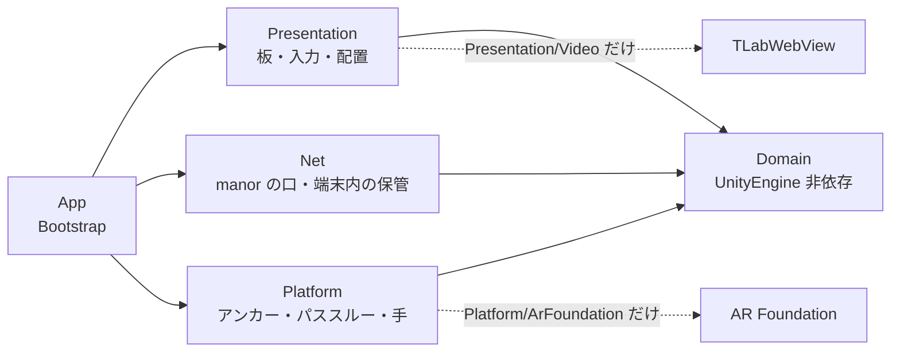

# 構成（層・板・入力・保管）

KitchenXR の中身がどう分かれていて、どこに何が書いてあるかをまとめます。
設計の理由は [`DESIGN.md`](DESIGN.md)、manor との連携は [`MANOR.md`](MANOR.md) に分けてあります。

## 1. 層と依存の向き

| 層 | 置き場 | 持つもの |
|---|---|---|
| Domain | `Assets/KitchenXR/Domain/` | `Recipe`・`Step`・`Phase`・`Ingredient`・`CookSession`（工程の状態機械）・`CookTimer`・`RecipeJson`／`RecipeListJson`／`MediaJson`（読み取り） |
| Platform | `Assets/KitchenXR/Platform/` | `IAnchorStore`・`IPassthroughControl`・`IHandInputPolicy` の口と、`ArFoundation/`・`Null/` の実装、`PanelPoseFile` |
| Net | `Assets/KitchenXR/Net/` | `ManorClient`・`ManorDiscovery`・`ManorSettings`・`ManorDeviceFile`・`RecipeStore`・`MediaStore`・`CookEventQueue`・`LastSessionStore` |
| Presentation | `Assets/KitchenXR/Presentation/` | 板（UI Toolkit）・`PokePress`・`PanelPlacement`・`WristMenu`・`FingertipCursor`・`Video/`・`Hazard/`（注意の板と領域） |
| App | `Assets/KitchenXR/App/` | `Bootstrap`（どのアダプタを挿すか）・`FileLog`・`Editor/`（シーン生成・ビルド） |

守っている規則は3つで、いずれも `Tests/EditMode/PlatformIsolationTests.cs` が検算します。

- **Domain は UnityEngine に依存しない。** `KitchenXR.Domain.asmdef` は
  `noEngineReferences: true`（参照は Newtonsoft.Json だけ）なので、構造として破れません。
- **機種・XR SDK 固有の呼び出しは `Platform/<系>/` の中だけ。**
  `UnityEngine.XR.ARFoundation`・`OVR`・`PXR` への言及がその外に出たら試験が落ちます
  （`Platform/PanelPoseFile.cs` や `Platform/Null/` も「外」です）。
- **WebView に触るのは `Presentation/Video/` の中だけ。** 板は `IVideoPlayer` の口しか見ません
  （WebView は Android にしか無いので、Editor では `NullVideoPlayer` に差し替わります）。

アセンブリは `KitchenXR.Domain`・`KitchenXR.Runtime`・`KitchenXR.App.Editor`・
`KitchenXR.Tests.EditMode`・`KitchenXR.Tests.PlayMode` の5つです。

## 2. 板の一覧

すべてワールド空間の UI Toolkit パネルで、`Presentation/WorldSpacePanelFactory` が一本の経路で
組み立てます（シーン生成と PlayMode 試験が同じ経路を通ります）。`PanelSettings` は World Space・
Pixels Per Unit 100、板の `localScale` は 0.2 なので **1 UI px = 2mm** です。

| 板 | 実装 | 大きさ | 何を持つか |
|---|---|---|---|
| 一覧 | `RecipeListPanel` | レシピの板と同じ | 3列のカード（写真・題名・分／分類／kcal）、設定の区画、ペアリング番号の覆い |
| レシピ | `RecipePanel` | 260×190 px ≒ 52×38cm | 工程の点列と進捗%、左に工程画像（正方形）、右に見出し・説明・材料の札・「次: …」、下に `[一覧へ][配置] … [戻る][次へ]` |
| 材料 | `IngredientsPanel` | 170×240 px ≒ 34×48cm | チェックの行（縦のみ。16 点までスクロール無し）。今の工程で使う材料を強調 |
| タイマー | `TimerPanel` | 220×220 px ≒ 44×44cm | 1/3/5/10 分と ±30 秒で作り、3つまで同時に動く。終了は合成音と点滅 |
| 動画 | `Presentation/Video/VideoPanel` | 16:9 は 354×224 px、9:16 は 206×264 px | 左に窓（WebView）・右に再生リスト（100 px 幅は向きで変えない）・下に操作部と札3行 |
| 手首メニュー | `WristMenu`・`WristMenuButton`・`PlacementMenuPanel` | 釦 22×22 px ≒ 4.4cm 角／メニューは頁で高さが変わる（130×92〜176 px） | 頁は4つ（下の表） |
| 注意の板 | `Presentation/Hazard/HazardPanel` | 100×60 px ≒ 20×12cm | 帯（琥珀か赤）＋記号＋題名、下に本文1〜2行。**触れない板** |
| 「消す」 | `Presentation/Hazard/HazardDeleteChip` | 34×24 px ≒ 6.8×4.8cm | 注意の板の右横に、配置モードの間だけ出る（2度押し） |

一覧とレシピは**同じ場所に置かれる2枚**で、アンカーの鍵も共有します（`panel.recipe`）。

手首メニューの板だけは**出している頁で高さが変わります**（`WorldSpacePanelFactory.Resize`。
動画の板の 16:9 ⇄ 9:16 と同じ仕掛け）——プリセットの一覧は縦に5行あって、配置の操作と
同じ高さには入りません。

| 頁 | 高さ | 中身 |
|---|---|---|
| 調理中 | 92 px | 「配置」1つ |
| 配置の操作 | 112 px | 「保存」「元に戻す」／「注意の板」「コンロの領域」／「板を手元に」「やめる」 |
| 注意の板 | 176 px | プリセットの釦が縦に並ぶ ＋「戻る」 |
| コンロの領域 | 124 px | 「囲む」「やり直す」／「上面 ±5cm」／「消す」（2度押し）「戻る」 |

## 3. 入力

- **ポークは押し下げで発火。** `Presentation/PokePress` が `PointerDown` に反応し、押し上げは
  見ません（手応えの無いホログラムは深く突き抜けるので、押し上げが板の中で起きません）。
  二重発火は `ClickDebounce`（600ms）と「その指が板から離れるまで次を受けない」で止めます。
  板の当たり判定の箱は**裏側にだけ** 24cm 伸ばしてあり、深く突き抜けても指が抜けません。
- **レイは層で絞る**（`Presentation/CookingModeInputGate`）。Near-Far Interactor は
  どちらのモードでも生かしたまま、届く先を2つの層で決めます。
  - Interaction Layer（XRI の 1 番 = `Video`）: 調理モードの Ray は `Video` だけ、配置モードは全部。
  - 物理層（8 番 `Kitchen Panel Off Ray`）: Interaction Layer は UI Toolkit の当たりには効かない
    ため、調理モードの間は動画以外の板をこの層へ移します。Ray の `raycastMask` からは外れ、
    `Physics.DefaultRaycastLayers` には残るので**指では押せてレイでは押せない**状態になります。
  - `RayLineVisibility` がホバー・選択のある間だけレイの線と `LineRenderer` を出します。
- **配置モード**（`PanelPlacement`）: Ray＋Grab で板を掴んで動かします。同じ鍵に重なった板は
  **見えている側を取っ手役**に選び、残りは引っ込めます。出口は手首メニューにしかないので、
  メニューが挿さっていない／手が1つも追えていないときは配置モードへ入りません。
- **指先カーソル**（`FingertipCursor`）: 板に 5cm 以内へ近づいたときだけ、人差し指の先に直径 8mm の
  球を出します。近いほど大きくして距離計にし、押した瞬間だけ一瞬強く光らせます。左右の手と
  コントローラの Poke Interactor 4つすべてに付きます。
- **効果音**（`PressSound`）: ボタンが発火した瞬間に短い音を1つ鳴らします。

## 4. オフライン優先（端末内の保管）

表示は**常に端末内の写しから**行い、サーバへの報せは待ち行列に積むだけです。すべて
`Application.persistentDataPath` の下に置きます（Quest 3 では
`/sdcard/Android/data/<applicationId>/files/`）。

| 置き場 | 実装 | 役割 |
|---|---|---|
| `recipes/index.json`・`recipes/<id>/recipe.json`・画像 | `Net/RecipeStore` | 一覧とレシピの写し。レシピを選ぶと契約 JSON と画像（hero＋全工程）を**先に全部**落としてから調理を始める |
| `media.json`（控えは `media.bundled.json`） | `Net/MediaStore` | 動画リストの写し。同梱の `StreamingAssets/media.json` は見本 |
| `media-thumbs/<video_id>.jpg` | `Presentation/Video/MediaThumbnailCache` | 再生リストのサムネイル。id ごとに決まるので一度取れば通信しない |
| `cook_events.jsonl` | `Net/CookEventQueue` | 進行（`next`／`prev`／`end`）の待ち行列。積んだ順に送り、送れた分だけ消す |
| `last_session.json` | `Net/LastSessionStore` | 最後に開いていた調理。manor に繋がらないときの復帰に使う |
| `settings.json` | `Presentation/DisplaySettings` | 文字と板の大きさ（小・中・大）。壊れていれば黙って既定に戻す |
| `hazards.json` | `Presentation/Hazard/HazardPanelFile` | 注意の板の鍵と種類（場所は `panels.json` とアンカーの側。§7.1） |
| `zones.json` | `Presentation/Hazard/HazardZoneFile` | コンロ等の領域（中心・広さ・向き・高さ。XR Origin 基準の相対。§7.2） |
| `logs/kitchenxr.log` | `App/FileLog` | 1MB で3世代まで回す |

`Bootstrap` の起動順は「待ち行列を流す → 途中の調理があれば復帰 → 無ければ一覧 →
選んだら手元へ先読み → 調理の板へ」です。**送れないことで調理は止まりません。**

## 5. アンカー（板の置き場所を覚える）

- `Platform/ArFoundation/ArAnchorStore` が AR Foundation の永続アンカーを使います
  （`TryAddAnchorAsync` → `TrySaveAnchorAsync` の `SerializableGuid` を `anchors.json` へ。
  復元は `TryLoadAnchorAsync`）。Saved Anchor Ids の列挙は非対応なので、GUID は自分で持ちます。
- **鍵は板1枚＝1つ**（`panel.recipe`・`panel.ingredients`・`panel.timer`・`panel.video`）。
  台所全体の座標系は作りません（アンカーは近いほど精度が高い）。
- **控え `panels.json`**（`Platform/PanelPoseFile`）に XR Origin 基準の相対 Pose を**必ず一緒に**
  書きます。部屋が変わればアンカーの復元は普通に失敗するので、受け皿が要ります。
- 復元の順は アンカー → 控え → 既定（頭の前 0.8m）。戻した板は 0.6 秒かけて薄く出します。
- アンカーも控えも位置と向きしか持たないので、**縮尺は起動のたびに `settings.json` から当て直します**。
- Editor の XR Simulation は Save／Load／Erase のどれも非対応なので、必ず控えの側を通ります。

> **板を置き直す手順**: ①手首の釦を反対の手で押してメニューを出し「配置」を押す
> （レシピ／一覧の板の頭の「配置」2度押しでも入れます）。②全部の板に琥珀の枠と取っ手が出るので、
> レイで指して掴んで置き直す（遠くからでも引き寄せられます）。奥へ行ってしまったら
> 「板を手元に」で初期配置へ戻します。③「保存」で覚えて調理モードへ戻る（「元に戻す」は
> 入る前の位置へ、「やめる」は戻して抜ける）。配置モードの間、調理の板のボタンは効きません。
>
> 同じメニューから「注意の板」（プリセットを選んで置く）と「コンロの領域」（レイで囲む）へも
> 入れます（§7）。どちらも「保存」で一緒に覚えます。

## 6. 動画の板（WebView を包む）

- `Assets/TLab/Youtube/Prefab/YoutubePlayer.prefab` を**書き換えずに包みます**。絵は
  プレハブのワールド空間 Canvas ＋ RawImage をそのまま「窓」の手前に重ねます——UI Toolkit の
  `backgroundImage` に貼り替えると、動的アトラスに焼かれて外部テクスチャの更新が届かず
  最初の1枚で固まります（実機でしか出ない止まり方）。当たり判定は UI 側の板だけが持ちます。
- `YoutubePlayer.cs` は asmdef の無いフォルダにあり `Assembly-CSharp` に入るため、
  `YoutubePlayerBridge` が**型の名前で引き当てて**呼びます（`TLabWebView` は asmdef を持つので
  型でそのまま呼べます）。
- **窓そのものに触れます。** `VideoPanel` が絵の中の比（u, v）に写して
  `IVideoPlayer.Touch(phase, u, v)` へ流し、`YoutubePlayerBridge` が解像度を掛けて
  `TLabWebView.TouchEvent` を送ります。窓は釦ではないので `PokePress` は通しません。
  - タップとドラッグは**板の側で見分ける**。動きが絵の幅の 3% を越えるまで DOWN を送らず、
    越えないまま 1.2 秒以内に離れたらタップ（DOWN → 80ms → UP を同じ座標で）。
    これをしないと手の震えが DRAG になり、WebView はスクロールと解釈してクリックを出しません。
  - 関連動画が `youtube.com/watch` へ遷移したら（0.5 秒ごとに URL を見ている）、
    URL から video_id を抜いて html を読み直し、埋め込みプレイヤーへ連れ戻します。
  - 読み込み後と向きの切り替えごとに、`html`・`body` の上でだけ `touchmove` を止める JS を送ります
    （iframe の中は素通し。html そのものは書き換えません）。
- 板の札は3行——中の様子と絵の実寸／板が最後にしたこと／最後の失敗（赤）。
  実機で切り分けるための唯一の窓口です。

## 7. 注意の板と領域（火気の注意）

カメラも認識も使いません。**認識器が落ちても警告は出る**形にするためで
（調査 [`research/2026-09-13_quest3-camera-and-recognition.md`](research/2026-09-13_quest3-camera-and-recognition.md) §3.3）、
置き場所と領域は利用者が手で置きます。実装は `Presentation/Hazard/` に閉じています。

### 7.1 注意の板

- **プリセット**は `Resources/Hazards/presets.json`（火気注意・熱い・刃物・滑りやすい・
  電子レンジ稼働中）。題名・短い本文・記号（`▲`／`△`）・帯の色（琥珀か赤）だけを持ちます。
  **絵文字は使いません**——フォントのアトラスと端末に左右されるので、記号と色で段を示します。
- 配置モード中に 手首メニュー →「注意の板」→ プリセットを選ぶと、**頭の前 50cm**（2枚目以降は
  右へ 25cm ずつ）に板が出て、そのまま掴んで置けます。
- **置き場所は既存の仕組みにそのまま乗ります。** `PanelPlacement` に鍵
  `panel.hazard.<uuid>` で登録するだけで、掴んで動かす・アンカーと控え（`panels.json`）へ
  覚える・起動時に アンカー → 控え → 既定 で戻す、が全部効きます（§5 と同じ道筋）。
  `hazards.json`（`Platform/PanelPoseFile` と同じ作り）が持つのは
  **「どの板が在って何の種類か」だけ**で、場所は持ちません。
- **調理中は触れない板**（表示だけ）。コライダーと `XRSimpleInteractable` を降ろし
  （`HazardPanel.SetPlacing`）、レイの層からも外します（`CookingModeInputGate`。§3 と同じ 8 番）。
- 「消す」（2度押し）は板の**兄弟**の小さな板です。子にすると `UIDocument` が自分の板を作らず
  親の中の要素になり、自分のコライダーと当たり点が噛み合いません。同じコライダーに載せないのは、
  配置モードの注意の板が掴む相手（`XRGrabInteractable`）になるためです（§5 の板と同じ話）。

### 7.2 コンロの領域

領域は**水平な上面の矩形1枚**です（`HazardZone`。中心・幅・奥行・水平回り・床からの高さ）。
立体ではないのが肝心——危ないのは天板の上の空間であって箱の中身ではないし、矩形までの
最短距離は閉じた式で書けます（`DistanceTo`。EditMode で検算）。

- **作図**（`HazardZoneDrawing`）は**指で描きます。レイは使いません**——コンロには
  レイが当たる物が無く（AR の平面はコンロを知らない）、実機では矩形がどこにも出ませんでした。
  位置は全て**つまんだ手の位置そのもの**です。

  「対角の2点」ではなく**「辺 → 奥行き」の2段階**なのは、対角の2点では**向きが決まらない**
  ためです（同じ2点を通る矩形は無数にあり、実機では矩形が斜めに転びました）。向きは
  **手前の辺そのもの**から取ります（`HazardZone.YawFromEdge`）。

  操作は 配置モード → 手首メニュー →「コンロの領域」→「囲む」のあと:

  1. **手前の辺**——コンロの手前の辺の**端で つまむ**（親指と人差し指）。そこに点が出て、
     その高さに水平な面が張られます。**つまんだまま**反対の端まで引くと、点から手まで
     線がリアルタイムに付いてきます。**離した位置**が辺のもう一方の端。
     札は「手前の辺の端で つまんで、反対の端まで引いて離す」。
  2. **奥行き**——**もう一度つまんだ瞬間から**長方形が出ます（半透明の面＋縁の線＋床への
     投影線）。手を辺に直角な向きへ射影した距離が奥行きで、手を動かすと矩形も付いてきます。
     **離した位置**で確定。奥行きの向きは**手のある側**（辺の手前でも奥でもよい）。
     札は「奥へ つまんで引いて離す」。
  3. 天板の高さがずれていたら「上面 ±5cm」で直します（最後に作った領域に効く）。

  手の高さは1段目の面に貼り付くので、**必ず水平な長方形**になります。辺の長さか奥行きが
  **5cm 未満**なら確定せず、**その段をもう一度待ちます**（札に「小さすぎます」）。
  ピンチを待つ間に **20 秒**何も無ければやめます（札に「囲むのをやめました」）。
  「やり直す」は最後の領域を捨てて1段目からやり直します。
- **ピンチの取り方**（`IPinchSource`）は2段構えです。1本目は XR Hands（`XRHandSubsystem`）
  ——`IndexTip` と `ThumbTip` の中点が位置、間隔が **2cm 未満**でつまんだ（離すのは 3.5cm。
  境目で震えて確定と再開を繰り返さないように）。関節の Pose は追跡原点基準なので XR Origin を
  通して世界へ出します。2本目は rig の select 入力（`XRBaseInputInteractor.logicalSelectState`）
  で、そのときの位置は一番近い `XRPokeInteractor` の attach（人差し指の先）から借ります。
  Editor では `ManualPinchSource` を差し込んで PlayMode で検算します（`NullPassthrough` と
  同じ流儀）。
- 描いている間は**レイの掴みを止めます**（`interactionLayers` を空に）。配置モードのレイは
  全ての層に届くので、描こうとしたピンチが視線の先の板を掴んで飛ばしてしまいます。
- **見せ方**は床に投影した縁の線を基本に、上面の枠を細く重ねます（`HazardZoneVisual`。
  `LineRenderer` を実行時に作る）。立体の枠は視界を塞ぐので作りません。
  **描いている途中だけ**、始点の点・**手前の辺の線**・上面の半透明の面を足します——
  線だけだと、真横から見たときや細長い矩形のときに何も無いのと区別が付きませんでした。
  辺の線は矩形とは別の `LineRenderer` です（1段目は矩形がまだ無く、2段目でも「どの辺から
  立ち上げたか」が見えている必要があるため）。
- **保存**はアンカー（鍵 `zone.<id>`）と控え `zones.json` の二段。アンカーは位置と向きしか
  持てないので、**広さと高さは必ず控えから**来ます（＝アンカーが復元できた領域でも
  `zones.json` が要る）。控えは XR Origin 基準の相対（`panels.json` と同じ約束）。
- **床の高さ**は XR Origin の y。Quest の追跡原点が床なので、これが一番素直で、AR の平面検出
  （コンロも調理台も意味ラベルが無い）に頼らずに済みます。
- 複数置けます（コンロ・オーブン等）。上面の高さは後から手首メニューの ±5cm で直せます
  （最後に作った領域に効く。つまんだ指先は天板の高さからずれるので）。

### 7.3 近づいたときの注意

`HazardProximity` が **10Hz** で、両手（Poke Interactor の指先）と頭から
各領域の**上面の矩形までの最短距離**を測ります。手の位置に XR Hands の関節を直に読まないのは、
コントローラを持っているときに何も取れなくなるからです。

| 距離 | 出すもの |
|---|---|
| 頭 60cm ／ 手 40cm | 床の線を琥珀で（`Watch`） |
| 手 20cm | 線を赤へ ＋ 低い音1つ（`Near`） |

- **5cm のヒステリシス**で境界の点滅を止めます（段が上がるのは素の閾値、下がるのは ＋5cm
  離れてから）。`HazardAlertState` が純粋な型として持ち、EditMode で検算します。
- 音は `Resources/Audio/hazard.wav`（165Hz と 110Hz・0.22 秒。釦の `press.wav` とは別の低い音）。
  段が上がった1回だけ、さらに **5 秒に1回まで**（`HazardSound`）——コンロの前で作業している
  間ずっと鳴っては意味を失います。
- 調理モードでも配置モードでも動きます。配置モードの間は**離れていても線を薄く出します**
  （領域が見えないと置き直せない）。

## 8. 表示の設定

一覧の板の「設定」で、一覧と**入れ替わりに**設定の区画が出ます（板は増やしません）。
「文字の大きさ [小][中][大]」「板の大きさ [小][中][大]」「閉じる」の3行だけで、押した瞬間に
反映して保存します（「決定」は置きません）。

- **文字**: `DisplaySettingsApplier` が板の `.root-panel` に `font-scale--small` /
  `font-scale--large` を付け外しし、`theme.uss` がその配下で `--font-size-*` を上書きします
  （小 ×0.85・大 ×1.25）。カスタムプロパティは継承するので中の要素も一緒に動きます。
- **板**: `localScale` を `WorldSpacePanelFactory.PanelLocalScale` × 係数（0.85／1.0／1.2）に
  します。コライダーはローカル単位なので一緒に拡縮され、押せる場所もずれません。
- 当てる先は一覧・レシピ・材料・タイマーの4枚。動画の板は自分で寸法を決める（16:9 ⇄ 9:16）ので
  混ぜません。手首メニューと配置の操作も、出ている間だけの板なので対象外です。
</content>
